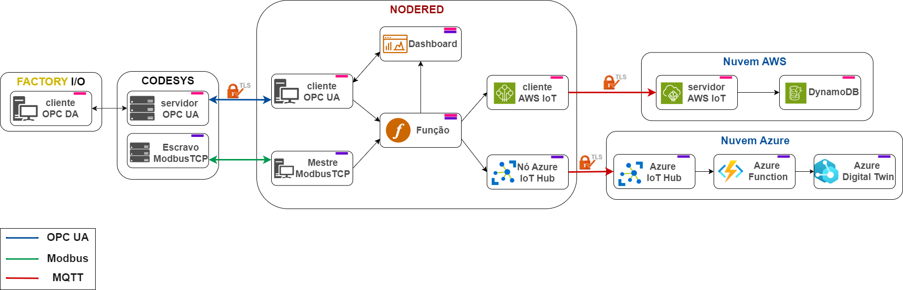
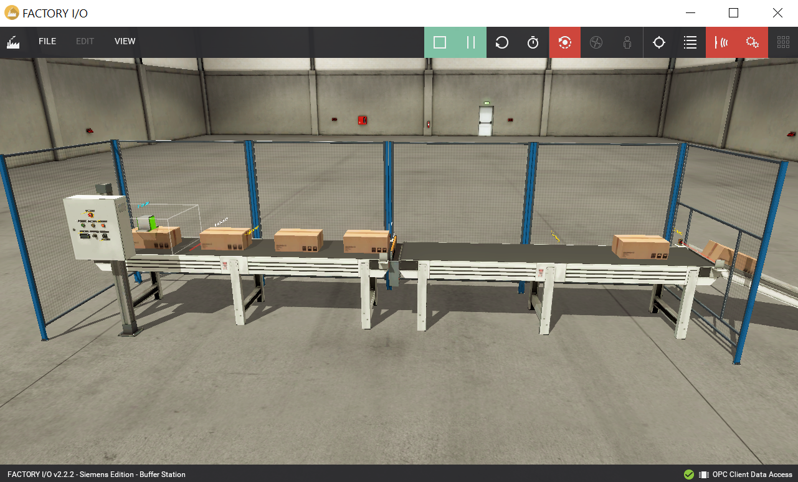
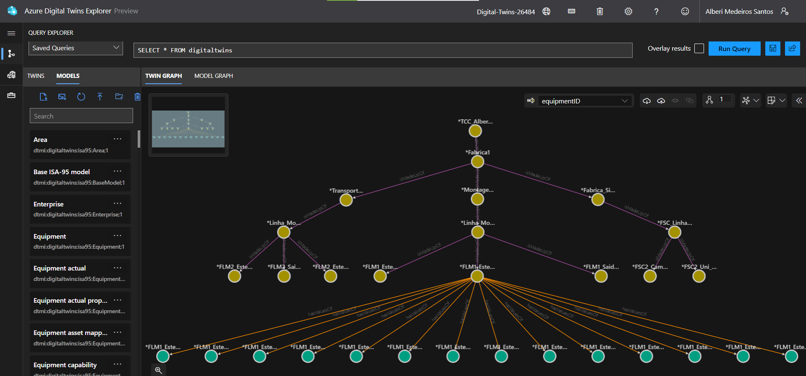
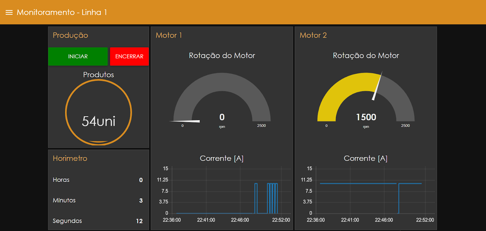

# Integração de Gêmeos Digitais e Protocolos de Comunicação para Interconexão e Mapeamento Dinâmico em um Ambiente Industrial Inteligente

## Caso de Uso: Integração Completa de Gêmeos Digitais e Interoperabilidade entre Dispositivos em um Ambiente Simulado de Indústria 4.0

### Resumo
Este caso de uso descreve a integração de dispositivos industriais simulados com sistemas de controle e plataformas de nuvem, utilizando protocolos de comunicação como OPC UA, MQTT, e Modbus, em conjunto com o framework Node-RED. A solução proposta também incorpora o uso de gêmeos digitais baseados na ontologia ISA-95, para criar uma representação virtual dos dispositivos físicos. O objetivo é validar a eficiência da arquitetura desenvolvida em um cenário simulado de Indústria 4.0, com foco em monitoramento, controle em tempo real e interoperabilidade. Veja a arquitetura do sistema na figura abaixo.

### Objetivo
Demonstrar a interconexão e integração de dispositivos industriais com sistemas de controle e plataformas de nuvem, utilizando diferentes protocolos de comunicação, além da implementação de gêmeos digitais para melhorar a visibilidade e controle de processos produtivos. A validação da solução foca em medir a interoperabilidade, eficiência e adaptabilidade da arquitetura em um cenário de Indústria 4.0.

### Componentes e Tecnologias Utilizadas
- **Protocolos de Comunicação**: OPC UA, MQTT, Modbus
- **Framework de Integração**: Node-RED
- **Plataforma de Simulação**: Factory I/O
- **Plataforma de Controle**: CODESYS
- **Serviço de Nuvem**: AWS IoT, Azure IoT Hub
- **Gêmeos Digitais**: Azure Digital Twins, Ontologia ISA-95
- **Segurança de Comunicação**: TLS (Transport Layer Security)

### Descrição do Processo
1. **Simulação Industrial**: Utilização do **Factory I/O** para simular um ambiente industrial que inclui esteiras, sensores de proximidade, motores e sistemas de controle. A cena "Buffer Station" foi usada para representar um processo de produção. Mais detalhes podem ser encontrados na documentação sobre o Factory I/O [aqui](https://github.com/AlberiSantos/IoT-SmartFactory-DigitalTwins/blob/main/factoryio.md).

Cena "Buffer Station":

   
2. **Comunicação via OPC UA**: Configuração de um servidor OPC UA no **CODESYS** para permitir a comunicação segura e padronizada entre o CLP virtual e o ambiente simulado. A comunicação foi protegida por criptografia TLS. Mais detalhes podem ser encontrados na documentação do módulo **CODESYS** [aqui](https://github.com/AlberiSantos/IoT-SmartFactory-DigitalTwins/blob/main/codesys/README.md).

3. **Integração com Gêmeos Digitais**: Representação virtual dos dispositivos físicos por meio de **gêmeos digitais** utilizando a **DTDL** (Digital Twin Definition Language) no **Azure Digital Twins**, com base na ontologia **ISA-95**, para otimizar o mapeamento e a visualização dos recursos industriais. Mais detalhes podem ser encontrados na documentação do módulo azure-digital-twins [aqui](https://github.com/AlberiSantos/IoT-SmartFactory-DigitalTwins/blob/main/azure-digital-twins/README.md).

Gráfico de relações dos gêmeos digitais:

4. **Orquestração com Node-RED**: O **Node-RED** foi utilizado para integrar os diferentes dispositivos e sistemas, como o CLP e sensores, e para conectar o sistema à nuvem AWS via **MQTT**. O **Node-RED** também facilitou a criação de dashboards interativos para monitoramento em tempo real. Mais detalhes podem ser encontrados na documentação do módulo Node-RED [aqui](https://github.com/AlberiSantos/IoT-SmartFactory-DigitalTwins/blob/main/node-red/README.md).

Dashboard implementado utilizando o Node-RED:

5. **Interoperabilidade de Protocolos**: A solução foi projetada para suportar múltiplos protocolos de comunicação, incluindo **Modbus** e **MQTT**, demonstrando a interoperabilidade do sistema ao conectar dispositivos legados com plataformas modernas, como o **Azure IoT Hub**.

6. **Segurança e Publicação na Nuvem**: Os dados capturados dos dispositivos foram publicados de forma segura na nuvem via **MQTT** com suporte a criptografia TLS. As mensagens de dados foram roteadas para o **AWS IoT** para armazenamento e análise, enquanto os gêmeos digitais foram atualizados no **Azure Digital Twins**.

7. **Monitoramento e Controle em Tempo Real**: O dashboard do **Node-RED** permitiu o controle remoto dos dispositivos, exibindo dados operacionais como contagem de produtos, status dos motores e logs de eventos críticos. A interface possibilitou o controle direto dos dispositivos simulados, como iniciar/parar as esteiras e ajustar parâmetros operacionais.

8. **Validação da Arquitetura**: Foram realizados testes de desempenho, incluindo a medição de **latência** e **throughput** para garantir a eficiência e confiabilidade da solução em um ambiente industrial simulado. As métricas coletadas foram essenciais para validar a comunicação entre dispositivos e nuvem.

### Resultados
Os testes demonstraram que a arquitetura oferece alta interoperabilidade entre diferentes protocolos de comunicação, além de permitir uma integração eficiente com plataformas de nuvem e gêmeos digitais. A solução foi capaz de mapear dinamicamente os dispositivos em tempo real e se ajustar automaticamente a mudanças no ambiente produtivo. A comunicação foi segura e a latência e throughput atenderam aos requisitos de um cenário de Indústria 4.0.

### Conclusão
A solução integrada, que combina gêmeos digitais, interoperabilidade de protocolos e comunicação segura, demonstrou ser eficiente e adaptável para ambientes industriais modernos. O sistema foi validado com sucesso em um cenário simulado de Indústria 4.0, provando sua capacidade de monitorar e controlar dispositivos em tempo real, enquanto se ajusta dinamicamente às operações industriais.
